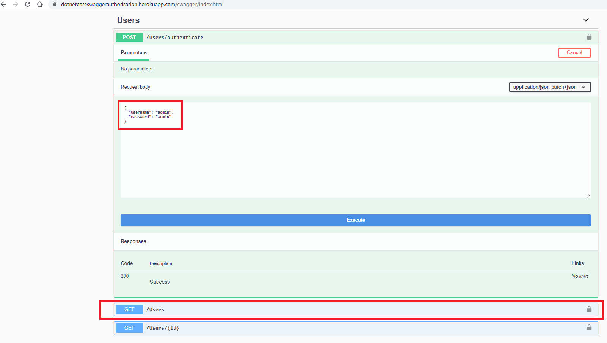
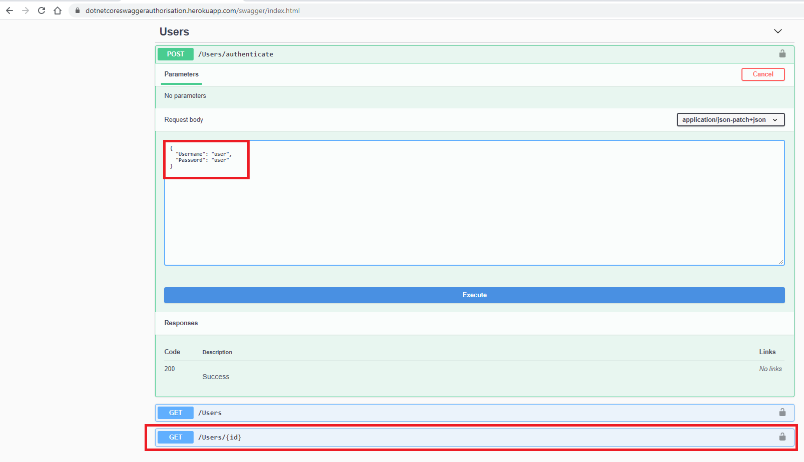

#  Dotnet Core Swagger Authorisation   

### AspDotnet Core Swagger Jwt Authentication and Authorisation

[](https://www.microsoft.com/net/download/dotnet-core/)  |  |  | 
| --- | ---          | ---        | ---      | 

---------------------------------------

 #### Please see the demo below

 

#### Login

 ``` 
 To access the /users endpoint
```
>    username :admin

>    password :admin


 


#### Login

 ``` 
 To access the /users/{id} endpoint
```
>    username :user

>    password :user


 

 

[](https://heroku.com/deploy?template=https://github.com/ajeetx/DotnetCoreSwaggerAuthorisation)


### Support or Contact

Having any trouble? Please read out this [documentation](https://github.com/AJEETX/DotnetCoreSwaggerAuthorisation/blob/master/README.md) or [contact](mailto:ajeetx@email.com) and to sort it out.

```
keep coding ;)
```

<a href="https://info.flagcounter.com/VOMj">

</a>

